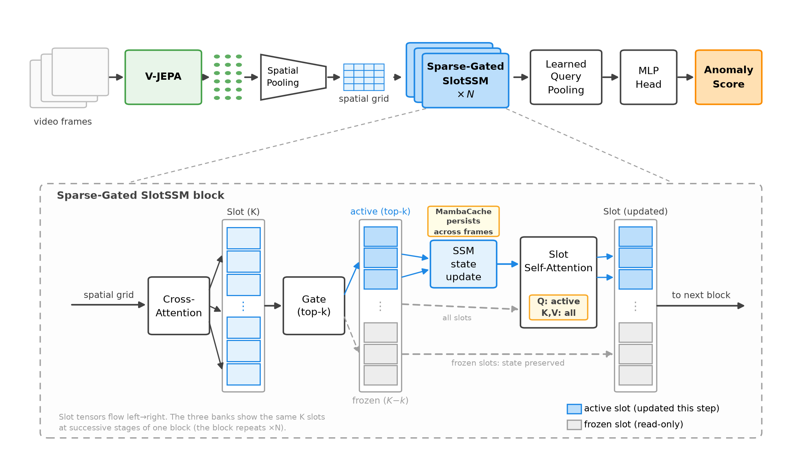
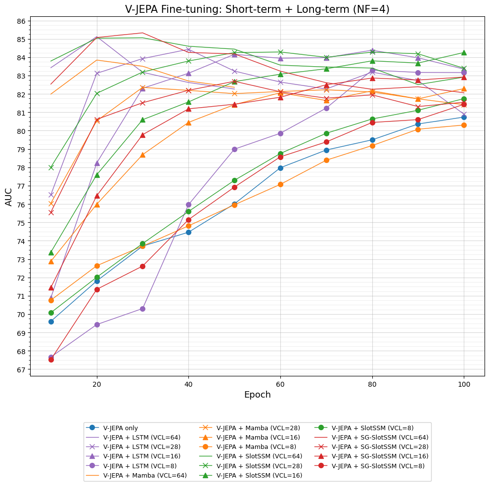

# **VAD-JEPA: Slot-Memory-Augmented Online Video Anomaly Detection With JEPA**

<p align="center">
  <a href="https://colab.research.google.com/drive/1kdLUm_Xd63EuodapMljrhVHXMbX68ARf?usp=sharing">
    
  </a>
  <a href="https://huggingface.co/Anshler/vad-jepa">
    
  </a>
</p>

This repository combines a **V-JEPA 2.1** video encoder with lightweight temporal models: LSTM, Mamba, SlotSSM, and our novel **Sparse-Gated SlotSSM (SG-SlotSSM)**, to detect anomalies in dashcam footage frame-by-frame under real-time constraints.

---

## Abstract

<br>

> Online video anomaly detection (VAD) in traffic scenarios requires accurate temporal reasoning under strict real-time constraints. While recent advances in predictive self-supervised learning have established Joint Embedding Predictive Architectures (JEPA) as a promising alternative to reconstruction-based representation learning, their suitability for online VAD remains unexplored. Existing online VAD systems predominantly rely on supervised visual encoders or reconstruction-based objectives, leaving open the question of whether predictive representations that discard fine-grained pixel details can effectively support anomaly detection.
>
>We present the first study of latent-space predictive representations (V-JEPA) as a visual backbone for online traffic VAD. Following the standard two-stage online pipeline, we combine a V-JEPA encoder with a family of state-space temporal models spanning Mamba, SlotSSM, and a novel **Sparse-Gated SlotSSM (SG-SlotSSM)** that introduces selective slot freezing to enable persistent long-term memory. All models are evaluated under comparable parameter budgets and identical online settings on the DoTA benchmark, allowing us to isolate the contributions of both visual representation learning and temporal memory.
>
>Our experiments show that replacing the supervised visual backbone with V-JEPA consistently improves detection performance across two-stage architectures, achieving higher frame-level AUC while preserving real-time operation. Furthermore, although SG-SlotSSM does not outperform dense slot memory under standard training regimes, it overtakes SlotSSM at the longest temporal horizon we test (VCL~=~64) and maintains a consistent advantage across training epochs, indicating that sparse persistent memory becomes increasingly effective as temporal context grows. Although reconstruction-based self-supervised representations that retain finer visual detail remain stronger overall, our findings establish predictive JEPA representations as a competitive foundation for online traffic video anomaly detection and identify sparse persistent memory as a promising direction for future long-horizon temporal modeling.

---

## Architecture

The two-stage pipeline decomposes online VAD into a visual encoder and a temporal model:

<p align="center">
  
</p>

SG-SlotSSM introduces **hard-sparse activation gating** into the SlotSSM architecture:

- **K=32 slots**, each with independent Mamba-2 dynamics
- **Top-k=16** active slots per timestep; inactive slots freeze bit-for-bit
- **ε-greedy** routing (ε=0.05) during training prevents dead slots
- **Entropy regularization** (λ=0.01) prevents routing collapse
- Active slots read from frozen slots via self-attention KV (read-only memory)

---

## Key Results

| Model | VCL | AUC-ROC |
|-------|:---:|:-------:|
|(Ours)|||
| **SG-SlotSSM** (unofficial best) | 64 | **85.6%** |
| **SlotSSM** (official best) | 28 | **84.3%** |
| **SG-SlotSSM** | 28 | 82.7% |
| **Mamba** | 28 | 82.4% |
| **Encoder-only** | — | 81.9% |
| (Related works) |||
| [**MOVAD**](https://github.com/IMPLabUniPr/movad) | 8 | 82.2% |
| [**DAPT-VideoMAE-S**](https://github.com/tue-mps/simple-tad) | — | 86.4% |
| **DAPT-VideoMAE-B** | — | 87.9% |
| **DAPT-VideoMAE-L** | — | 88.4% |

<p align="center">
  
  <br>
  <em>Temporal model training curves on the DoTA benchmark. SlotSSM achieves the best official performance at 84.3% AUC.</em>
</p>

---

## What's New

- **First systematic study** of V-JEPA representations for online traffic video anomaly detection
- **SG-SlotSSM** — a novel sparse-gated slot-based state-space memory that freezes inactive slots for persistent long-term memory, with ε-greedy routing and entropy regularization
- **V-JEPA +7.4 AUC** over supervised Swin-B at the encoder-only level (81.9% vs. 74.5%)

---

## Temporal Model Variants

| Config | Temporal Model | Type | Pre-proj | Temporal | Post-cls | **Trainable (Non-encoder)** |
|--------|---------------|:----:|:--------:|:--------:|:--------:|:-------------:|
| `vjepa_v1.yaml` | 3-layer LSTM | Recurrent | 28.37M | 25.19M | 1.05M | **54.6M** |
| `vjepa_mamba.yaml` | Mamba-2 × 3 | SSM | 28.37M | 19.81M | 1.05M | **49.2M** |
| `vjepa_slotssm.yaml` | SlotSSM | Slot SSM | — | 16.89M | 1.58M | **18.5M** |
| `vjepa_sparse_slotssm.yaml` | SG-SlotSSM | Slot SSM | — | 16.90M | 1.58M | **18.5M** |
| `vjepa_linear_probe.yaml` | Per-frame MLP | Encoder Only | 28.37M | — | 1.05M | **29.4M** |

> *Pre-proj* is the linear projection from the flattened 6×6 spatial grid (27K dim) → temporal input dim. SlotSSM variants avoid this by projecting per-block via cross-attention (768D → 512D).

---

> **⚠️ Prerequisite: V-JEPA 2.1 source code required**
>
> This project does **not** package the V-JEPA 2.1 encoder — it imports the model
> definitions directly from [facebookresearch/vjepa2](https://github.com/facebookresearch/vjepa2)
> via `from app.vjepa_2_1.models.vision_transformer import ...`.
>
> Clone the V-JEPA 2.1 repo as a **sibling directory** so the import resolves:
>
> ```bash
> git clone git@github.com:facebookresearch/vjepa2.git ../vjepa2
> ```
>
> The expected layout is:
> ```
> your-workspace/
> ├── vjepa2/          ← cloned from facebookresearch/vjepa2
> └── vad-jepa/     ← this repo
> ```

### Pretrained Weights

**You must download a V-JEPA 2.1 checkpoint.** The ViT encoder is loaded from a pretrained `.pt` file.

Download from the [V-JEPA 2 page](https://github.com/facebookresearch/vjepa2):

| Model | Checkpoint | Config |
|-------|-----------|--------|
| ViT-B/16 | `vjepa2_1_vitb_dist_vitG_384.pt` | Default (all `cfgs/*.yaml`) |

Update `checkpoint_path` in your config:

```yaml
checkpoint_path: /path/to/vjepa2_1_vitb_dist_vitG_384.pt
```

### 🤗 Pretrained Temporal Model Weights

Pre-trained temporal model checkpoints (LSTM, Mamba, SlotSSM, SG-SlotSSM) are available on Hugging Face:

<p align="center">
  <a href="https://huggingface.co/Anshler/vad-jepa">
    
  </a>
</p>

Download a checkpoint and point your config's `checkpoint_path` to the encoder weights (from V-JEPA 2.1), then specify the temporal head checkpoint at test time via `--epoch`:

```bash
python main.py --config cfgs/vjepa_slotssm.yaml --phase test --epoch 190
```

| Variant | Config | Download |
|---------|--------|----------|
| SG-SlotSSM (VCL=64, best) | `cfgs/vjepa_sparse_slotssm.yaml` | [`sg_slotssm_vcl64_best.pt`](https://huggingface.co/Anshler/vad-jepa) |
| SlotSSM (VCL=28, best) | `cfgs/vjepa_slotssm.yaml` | [`slotssm_vcl28_best.pt`](https://huggingface.co/Anshler/vad-jepa) |
| Mamba (VCL=28) | `cfgs/vjepa_mamba.yaml` | [`mamba_vcl28.pt`](https://huggingface.co/Anshler/vad-jepa) |
| LSTM (VCL=8) | `cfgs/vjepa_v1.yaml` | [`lstm_vcl8.pt`](https://huggingface.co/Anshler/vad-jepa) |

### Dataset: DoTA

1. Download [DoTA](https://github.com/MoonBlvd/Detection-of-Traffic-Anomaly).
2. Update `data_path` in your config:

```yaml
data_path: /path/to/data/dota
```

Expected structure:

```
data/dota
├── annotations
│   ├── 0qfbmt4G8Rw_000306.json
│   ├── 0qfbmt4G8Rw_000435.json
│   ├── 0qfbmt4G8Rw_000602.json
│   ...
├── frames
│   ├── 0qfbmt4G8Rw_000072
│   ├── 0qfbmt4G8Rw_000306
│   ├── 0qfbmt4G8Rw_000435
│   .... 
└── metadata
    ├── metadata_train.json
    ├── metadata_val.json
    ├── train_split.txt
    └── val_split.txt
```

---

## Usage

### Train

```bash
# Single model (finetuned encoder)
python main.py --config cfgs/vjepa_slotssm.yaml --phase train --epochs 200 --train_encoder

# Multi-head (SlotSSM + SG-SlotSSM side-by-side, only for frozen encoder)
python main.py --config cfgs/vjepa_slotssm.yaml cfgs/vjepa_sparse_slotssm.yaml --phase train --epochs 200

# Override hyperparameters from CLI
python main.py --config cfgs/vjepa_slotssm.yaml --phase train --batch_size 64 --lr 0.0001
```

### Evaluate

```bash
python main.py --config cfgs/vjepa_slotssm.yaml --phase test --epoch 190
```

### Resume training

```bash
python main.py --config cfgs/vjepa_slotssm.yaml --phase train --epoch 50
```

### Key CLI Flags

| Flag | Default | Description |
|------|---------|-------------|
| `--config` | `cfgs/vjepa_slotssm.yaml cfgs/vjepa_sparse_slotssm.yaml` | Config file(s); first = master |
| `--phase` | `train` | `train` or `test` |
| `--epochs` | `200` | Total training epochs |
| `--epoch` | `-1` | Resume epoch (train) or eval epoch (test) |
| `--batch_size` | from config | Override batch size |
| `--lr` | from config | Override learning rate |
| `--train_encoder` | off | Jointly fine-tune the V-JEPA encoder |
| `--enable_validation` | from config | Run validation during training |
| `--validation_epoch_step` | from config | Validate every N epochs |
| `--num_frames` / `--NF` | from config | Frames per encoder clip |
| `--VCL` | from config | Video clip length in frames |
| `--checkpoint_path` | from config | Override encoder checkpoint path |
| `--data_path` | from config | Override dataset root path |
| `--val_batch_size` | `2` | Batch size for validation/testing |

---

## Project Structure

```
vad-jepa/
├── main.py                        # Entry point — training & evaluation
├── model.py                       # ClsVJEPA + MultiHeadVJEPA + all temporal models
├── vjepa_encoder.py               # Frozen V-JEPA 2.1 ViT wrapper
├── swin_encoder.py                # Swin Transformer 3D (MOVAD parity)
├── video_swin_transformer.py      # Video Swin-B implementation
├── movad_core/
│   ├── dota.py                    # DoTA dataset loader
│   ├── losses.py                  # Weighted CrossEntropy (AMP-safe)
│   ├── metrics.py                 # AUC, AP, F1 evaluation
│   ├── data_transform.py          # Video augmentations + padding collate
│   ├── optim.py                   # Optimizer builder
│   ├── utils.py                   # Checkpoint I/O, metrics helpers
│   └── wandb_utils.py             # Weights & Biases init
├── cfgs/
│   ├── vjepa_v1.yaml              # LSTM baseline
│   ├── vjepa_mamba.yaml           # Mamba-2
│   ├── vjepa_slotssm.yaml         # SlotSSM (dense)
│   ├── vjepa_sparse_slotssm.yaml  # SG-SlotSSM (sparse)
│   ├── vjepa_linear_probe.yaml    # Encoder only
│   └── test_run.yaml              # Smoke-test config
├── tests/
│   ├── test_inference.py          # Smoke tests for all temporal models
│   ├── test_training.py           # Training overfit tests
│   ├── test_overfit.py            # Extended overfit tests
│   ├── bench_encoder_opts.py      # Model throughput benchmark for different optimization strategy
│   ├── benchmark_latency.py       # Model throughput benchmark for different temporal config
│   ├── diagnose_checkpoint.py     # Checkpoint key diagnostics, load MOVAD checkpoint and convert format
│   ├── diag_slots.py              # Slot usage analysis (SlotSSM)
│   ├── diag_sparse_gate.py        # Sparse gate diagnostics
│   ├── quick_val.py               # Fast validation on subset
│   └── verify_params.py           # Parameter count verification
├── figures/
│   ├── architecture.png           # SG-SlotSSM architecture diagram
│   └── longterm.png               # Temporal model training curves
├── NOTICE                         # Third-party attribution
└── LICENSE                        # GPL v2
```

---

## License & Attribution

This project contains original code and adapted components from open-source projects. The combined work is distributed under the **GNU General Public License v2** (see [`LICENSE`](LICENSE)).

| Component | Source | License | Included? |
|-----------|--------|---------|-----------|
| MOVAD dataset loader, metrics | [MOVAD](https://github.com/hachreak/movad) | GPL v2 | Yes (adapted in `movad_core/`) |
| Slot SSM blocks | [SlotSSMs](https://github.com/JindongJiang/SlotSSMs) | MIT | Yes (in `model.py`) |
| Original contributions | This work | MIT | Yes |
| V-JEPA 2.1 encoder | [VJEPA2](https://github.com/facebookresearch/vjepa2) | MIT | **No** — imported at runtime from a sibling clone (see [setup](#pretrained-weights) above) |

See [`NOTICE`](NOTICE) for full attribution.

---

<p align="center">
  <sub>Built with <a href="https://github.com/facebookresearch/vjepa2">V-JEPA 2.1</a>, <a href="https://github.com/state-spaces/mamba">Mamba</a>, <a href="https://github.com/hachreak/movad">MOVAD</a>, and <a href="https://github.com/JindongJiang/SlotSSMs">SlotSSMs</a>.</sub>
</p>